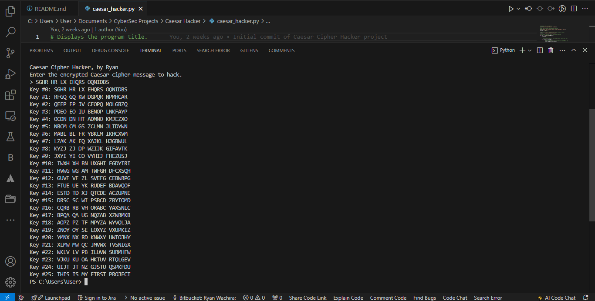

# Caesar Cipher Hacker

This project is a Python script that hacks messages encrypted with the Caesar Cipher using a brute-force method. The script tries all possible keys (shifts) to decrypt the message and displays the results for each key.

## How It Works

- The program asks the user to input an encrypted message.
- It then loops through every possible key (0-25) and attempts to decrypt the message by shifting each letter.
- The program outputs each possible decryption so the user can identify the correct one.

## Features

- Brute-force decryption of Caesar Cipher.
- Handles uppercase letters and leaves non-alphabetic characters unchanged.

## Usage

1. Run the script in a Python environment.
2. Input the encrypted message when prompted.
3. Review the output for each key and identify the correct decryption.

## Skills Gained

- Understanding of cryptography and brute-force techniques.
- Improved Python programming skills, including string manipulation and control flow.

## Example

```
Enter the encrypted Caesar cipher message to hack.
> SGHR HR LX EHQRS OQNIDBS
Key #0: SGHR HR LX EHQRS OQNIDBS
Key #1: RFGQ GQ KW DGPQR NPMHCAR
Key #2: QEFP FP JV CFOPQ MOLGBZQ
Key #3: PDEO EO IU BENOP LNKFAYP
Key #4: OCDN DN HT ADMNO KMJEZXO
Key #5: NBCM CM GS ZCLMN JLIDYWN
Key #6: MABL BL FR YBKLM IKHCXVM
Key #7: LZAK AK EQ XAJKL HJGBWUL
Key #8: KYZJ ZJ DP WZIJK GIFAVTK
Key #9: JXYI YI CO VYHIJ FHEZUSJ
Key #10: IWXH XH BN UXGHI EGDYTRI
Key #11: HVWG WG AM TWFGH DFCXSQH
Key #12: GUVF VF ZL SVEFG CEBWRPG
Key #13: FTUE UE YK RUDEF BDAVQOF
Key #14: ESTD TD XJ QTCDE ACZUPNE
Key #15: DRSC SC WI PSBCD ZBYTOMD
Key #16: CQRB RB VH ORABC YAXSNLC
Key #17: BPQA QA UG NQZAB XZWRMKB
Key #18: AOPZ PZ TF MPYZA WYVQLJA
Key #19: ZNOY OY SE LOXYZ VXUPKIZ
Key #20: YMNX NX RD KNWXY UWTOJHY
Key #21: XLMW MW QC JMVWX TVSNIGX
Key #17: BPQA QA UG NQZAB XZWRMKB
Key #18: AOPZ PZ TF MPYZA WYVQLJA
Key #19: ZNOY OY SE LOXYZ VXUPKIZ
Key #20: YMNX NX RD KNWXY UWTOJHY
Key #17: BPQA QA UG NQZAB XZWRMKB
Key #18: AOPZ PZ TF MPYZA WYVQLJA
Key #19: ZNOY OY SE LOXYZ VXUPKIZ
Key #17: BPQA QA UG NQZAB XZWRMKB
Key #18: AOPZ PZ TF MPYZA WYVQLJA
Key #19: ZNOY OY SE LOXYZ VXUPKIZ
Key #17: BPQA QA UG NQZAB XZWRMKB
Key #18: AOPZ PZ TF MPYZA WYVQLJA
Key #17: BPQA QA UG NQZAB XZWRMKB
Key #18: AOPZ PZ TF MPYZA WYVQLJA
Key #19: ZNOY OY SE LOXYZ VXUPKIZ
Key #17: BPQA QA UG NQZAB XZWRMKB
Key #18: AOPZ PZ TF MPYZA WYVQLJA
Key #19: ZNOY OY SE LOXYZ VXUPKIZ
Key #20: YMNX NX RD KNWXY UWTOJHY
Key #17: BPQA QA UG NQZAB XZWRMKB
Key #18: AOPZ PZ TF MPYZA WYVQLJA
Key #19: ZNOY OY SE LOXYZ VXUPKIZ
Key #20: YMNX NX RD KNWXY UWTOJHY
Key #17: BPQA QA UG NQZAB XZWRMKB
Key #18: AOPZ PZ TF MPYZA WYVQLJA
Key #19: ZNOY OY SE LOXYZ VXUPKIZ
Key #17: BPQA QA UG NQZAB XZWRMKB
Key #17: BPQA QA UG NQZAB XZWRMKB
Key #17: BPQA QA UG NQZAB XZWRMKB
Key #18: AOPZ PZ TF MPYZA WYVQLJA
Key #19: ZNOY OY SE LOXYZ VXUPKIZ
Key #20: YMNX NX RD KNWXY UWTOJHY
Key #21: XLMW MW QC JMVWX TVSNIGX
Key #22: WKLV LV PB ILUVW SURMHFW
Key #17: BPQA QA UG NQZAB XZWRMKB
Key #18: AOPZ PZ TF MPYZA WYVQLJA
Key #19: ZNOY OY SE LOXYZ VXUPKIZ
Key #20: YMNX NX RD KNWXY UWTOJHY
Key #21: XLMW MW QC JMVWX TVSNIGX
Key #22: WKLV LV PB ILUVW SURMHFW
Key #23: VJKU KU OA HKTUV RTQLGEV
Key #24: UIJT JT NZ GJSTU QSPKFDU
Key #25: THIS IS MY FIRST PROJECT
```

